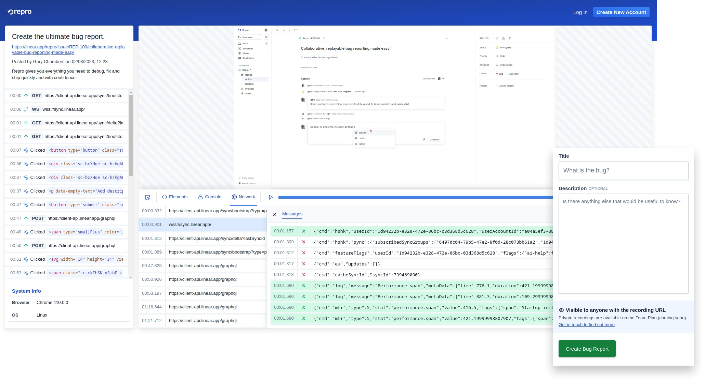

The open-source developer tool and browser extension to make bug reporting in the browser more collaborative and reproducible. Repro shortens the debugging cycle in web development and empowers teams to painlessly ship defect-free software to users. Built for high-performing product teams.

Get started here: https://repro.dev

---

## Why Use Repro?

Repro brings together powerful features that make reproducing and fixing bugs simple:

* **Session recording**: Rewind and replay bugs easily with instant session recording. Capture every click and key press.
* **Console logs & errors**: Replay logs, warnings and errors, with stack traces to understand when and why errors are thrown.
* **Network requests & responses**: Capture and review network requests, responses and headers.
* **DOM, styling & layout**: View changes to the DOM and styling over time, using a replayable element inspector.

Use Repro for faster debugging, better software and happier users!

## Cloud Edition

The easiest way to get up and running with Repro is to sign up for our hosted cloud edition. Just download the Repro browser extension, create a free account and then forget that you ever hated bugs!

Learn more here: https://repro.dev

## Open Source Edition

Repro is committed to building the best possible debugging and software quality platform, available to anyone. We are proud to offer an open-source, self-hosted edition, giving you the full power of Repro locally and on your own infrastructure.

### Quickstart (development mode)

1. Prerequisites: this project uses [pnpm](https://pnpm.io/) for dependency management.
1. Install dependencies and build all packages: `pnpm install`

#### 1. Chrome extension

1. Navigate to client app: `cd apps/client`
1. Set up build environment: `cp .env.example .env` (edit as required)
1. Create & watch build: `pnpm watch:capture`
1. Load unpacked browser extension from `dist/capture` ([learn more](https://developer.chrome.com/docs/extensions/mv3/getstarted/development-basics/#load-unpacked)).

#### 2. Workspace application

1. Navigate to client app: `cd apps/client`
1. Set up build environment (if not completed above): `cp .env.example .env` (edit as required)
1. Run development server: `pnpm serve:main` 

#### 3. API server

1. Navigate to API server app: `cd apps/api-server`
1. Set up build environment: `cp .env.example .env` (edit as required)
1. Run API server: `pnpm watch`

### Contributing

We welcome any contributions, big or small. Help us build the bug-bashing tool you've always wanted :) Please open an issue or pull request on this repo if you would like to make a change.

### License

All code in this repository is licensed under the the terms of the Apache License, Version 2.0. Additional features may be available to users of the Repro cloud edition under an alternative license.
